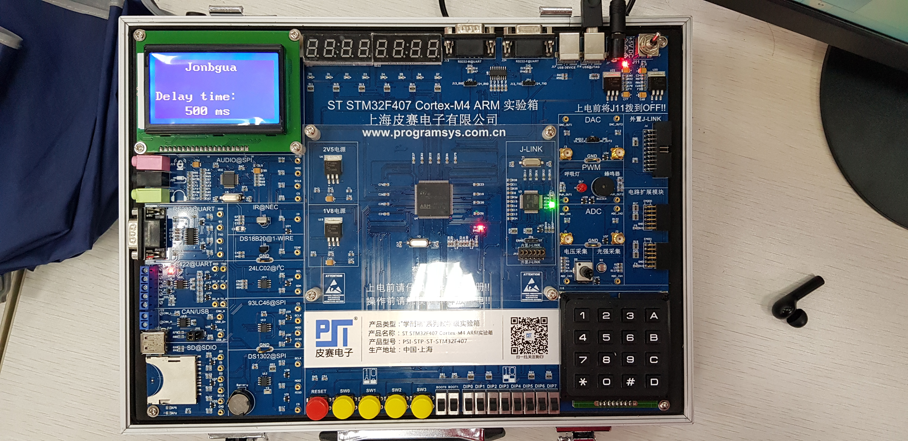
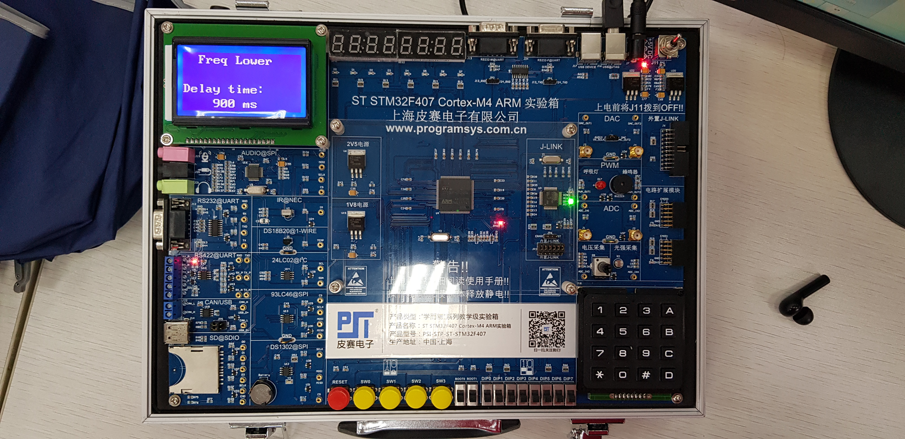
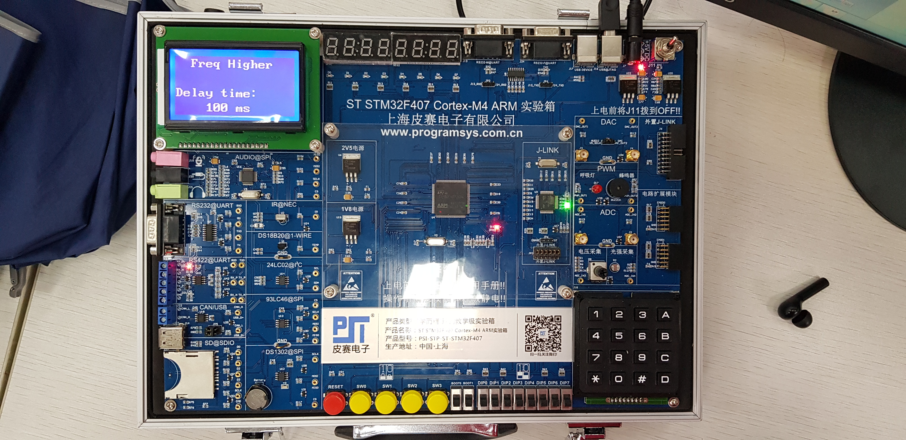
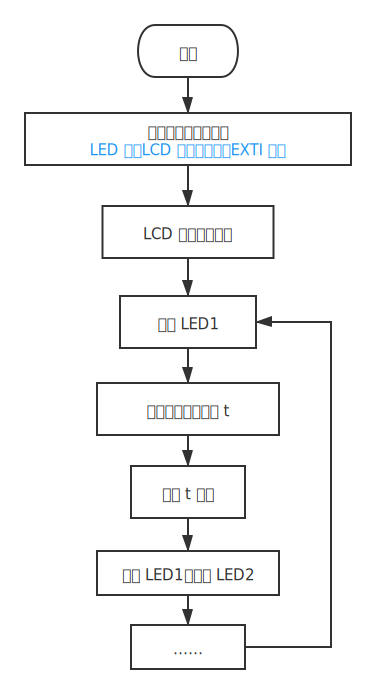
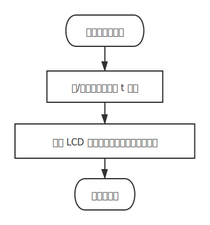

# 综合实验：按键控制流水灯速度

此项目系《微机原理与嵌入式系统实验》的综合实验项目。


## 需求分析

实现一串流水灯，用户可通过按键增/减其流水变化的速度。用户可通过 LCD 显示屏监视当前流水速度的大小。

本项目共用到了 3 个模块，包括：GPIO、EXTI 和 LCD。


### 创新点

- 相比其它流水灯实现，本项目可以在 LCD 显示屏上实时显示按钮按下状态以及流水速度。
- 本项目使用了中断来响应按钮按下事件，而非周期性轮询，使反馈更实时。


### 迭代

本项目经历了多次迭代。

第一版作为可行性验证版本，并未使用 EXTI 中断，而是轮询按键按下状态并对速度进行增减。这一版本实现了按键调整流水灯速度和 LCD 提示等功能。但由于轮询结构的限制，需要长按按钮等待下一个轮询周期开始才可成功侦测到按键被按下。

最终版加入了 EXTI 中断。用户可在任意时间短按按钮，触发相应中断，实现流水灯速度的增减。此版本功能较为完善，各模块划分比较清晰。


### 最终效果

亦可参见 [效果视频[mp4]](https://f000.b2.jonbgua.com/file/jonbgua-video/PMES-variable-water-light/20210627_164844.mp4)，附录中有方便手动输入的短网址。

开机，初始延时为 500ms，LCD 显示作者名和初始参数。



按下左侧按钮，流水速度变慢，LCD 提示「频率降低」。



按下右侧按钮，流水速度加快，LCD 提示「频率升高」。




## 软件流程设计

### 主流程

主流程由初始化部分和一个无限循环组成，详见下图。其中延时时间变量 `t` 为存在 `main.c` 的全局变量，故在主函数和中断服务函数中均能访问并修改。



### 中断服务子程序

按下按键后将触发中断服务，如下图所示。





## 核心代码

完整的代码库见：https://github.com/jonbhw/PMES-variable-water-light。


### 头部引用与声明

```c
#include <stdio.h>

#include "stm32f4xx.h"
#include "delay.h"
#include "led.h"
#include "key.h"
#include "exti.h"
#include "12864.h"

int led_delay = 500;	// 延时时间变量（单位: ms）
```


### 主函数

即 `main()`。

```c
/* 供 LCD 显示用的字符串变量 */
unsigned char a[20];

/* 初始化 */
NVIC_PriorityGroupConfig(NVIC_PriorityGroup_2);
// ...

/* LCD 显示初始参数 */
lcd_wstr(1,1,"  Jonbgua");		// 作者名字
lcd_wstr(3,0,"Delay time:");
sprintf(a, "%d ms", led_delay);
lcd_wstr(4,2, a);

/* 无限循环: 流水灯 */
while (1) {
    LED0=1; delay_ms(led_delay); LED0=0; delay_ms(led_delay);
    // ...
    LED7=1; delay_ms(led_delay); LED7=0; delay_ms(led_delay);
};
```


### 中断服务函数

以连接在 GPIO_0 的左侧按键 SW0（减速键）为例。

```c
void EXTI0_IRQHandler(void) {
  unsigned char a[20];
  if (EXTI_GetITStatus(EXTI_Line0) != RESET)  // 判断某个线上的中断是否发生
  {
    delay_ms(20);

	/* 修改延时时间变量 */
    led_delay += 200;	// 延时增加，即流水速度变慢
    
    /* 修改 LCD 屏幕显示 */
    lcd_clear();
    delay_ms(20);
    lcd_wstr(1,1,"Freq Lower");
    lcd_wstr(3,0,"Delay time:");
    sprintf(a, "%d ms", led_delay);
    lcd_wstr(4,2, a);

    /* 复位 EXTI */
    EXTI_ClearITPendingBit(EXTI_Line0);  // 清除 LINE 上的中断标志位
  }
}
```

对于加速键，若 `led_delay` 已降至 0，则不再改变其值，不存在延时时间变量取负值的情况。


### 初始化函数

参见项目 `./src/HARDWARE/` 下对应模块的文件夹。


## 总结

本项目实现了简单的 LED 流水灯，并在其基础上加入了调速和 LCD 参数显示等功能。


## 附录

- 本项目在 GitHub 上的仓库：[JiangGua/PMES-variable-water-light - Github](https://github.com/jonbhw/PMES-variable-water-light)

- [效果视频](https://f000.b2.jonbgua.com/file/jonbgua-video/PMES-variable-water-light/20210627_164844.mp4) | [备用地址](https://jonbgua-video.s3.us-west-000.backblazeb2.com/PMES-variable-water-light/20210627_164844.mp4) | 短网址：https://s.jonbgua.com/YwFQY3

